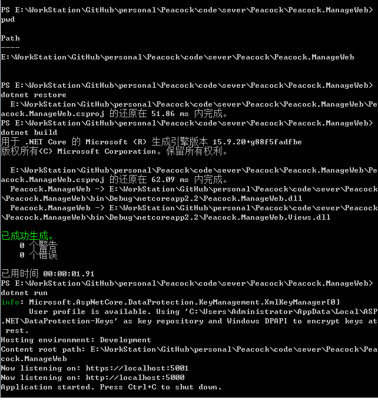
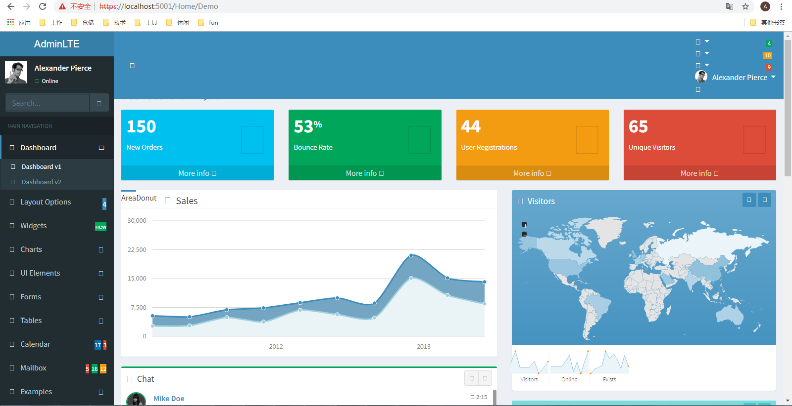

# Peacock

## 准备工作
后台项目使用.net core2.2 编写，若运行需要安装.net core 2.2版本的sdk，官方下载地址为 https://dotnet.microsoft.com/download

## 如何运行后台项目
1. 打开命令行工具，windons可运行cmd.exe或powershell
2. 切换目录到Peacock.ManageWeb
3. 执行 dotnet restore 命令，还原nuget包
4. 执行 dotnet build 命令，构建项目
5. 执行 dotnet run 命令，运行项目

项目启动后，到浏览器访问终端显示的链接地址，demo页相对路径为/Home/Demo

